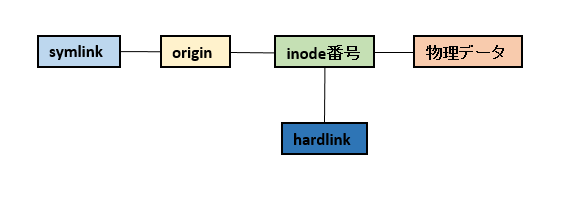
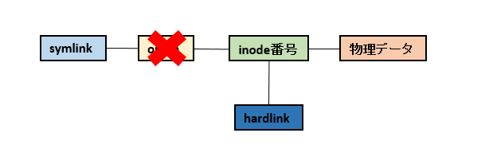

name: inverse
layout: true
class: center, middle, inverse

---
# ファイルとリンク

---
layout: false
class: center, middle


---
class: center, middle

# うーん…？


---
## 対象者

* Windows、Linux使ってる
* ファイルわからない
* リンクわからない

<br/>

## 目標

* ファイル少しわかるようになる
* リンク少しわかるようになる

---
class: center, middle, inverse
# ファイルとは？

---
## ファイルシステム

* OS内でディスク管理を行うシステム
* ファイルの保存、暗号化、圧縮等の機能を持つ
* ディスクのパーティション毎にフォーマットされる
* ファイルのメタデータを管理


---
## ファイルシステムの種類

|&nbsp;ファイルシステム名&nbsp;|&nbsp;最大ファイルサイズ&nbsp;|&nbsp;最大ボリュームサイズ&nbsp;|主な利用先|
|:--:|:--:|:--:|--|
|FAT32|4GiB|2TiB|Windows(32bit)|
|ext4|16TiB|1EiB|Linux|
|NTFS|16EiB|16EiB|Windows|
|XFS|8EiB|8EiB|Linux|
|ISO 9660|-|-|CD-ROM|
|UDF|-|-|DVD-ROM|

---
## 分散ファイルシステム

* DFS(Distributed File System)
* 他のサーバやストレージ上に構築されているファイルシステムをネットワーク経由で利用
* 複数のサーバーに存在する共有フォルダが、あたかも1台のサーバーに存在するように見える
* オンラインストレージを構築後、マウント(Linux)orネットワーク共有(Windows)を行う

---
class: center, middle, inverse
## Linux/UNIXのファイル管理

---
## ファイルのメタデータ

* inodeを使用
* ext4ではサイズ固定、xfsではサイズ可変
* 特定ファイルやディレクトリのinode情報を見る場合はstatコマンド

```console
$ touch testfile 
$ stat testfile
  File: testfile
  Size: 5               Blocks: 1          IO Block: 65536  regular file
Device: 461fa2c7h/1176478407d   Inode: 1407374883903937  Links: 1
Access: (0644/-rw-r--r--)  Uid: (1055875/user)   Gid: (1049089/ UNKNOWN)
Access: 2018-11-08 11:35:59.961116900 +0900
Modify: 2018-11-08 11:35:59.961116900 +0900
Change: 2018-11-08 11:35:59.961116900 +0900
 Birth: 2018-11-08 11:35:59.961116900 +0900

```

---
## ディレクトリエントリ

* ディレクトリ自体に記される情報
* inode番号とファイル名orディレクトリ名を含む
* lsコマンドで確認

```console
$ ls -i | cat
 844424930482628 directory1/
 844424930482629 directory2/
1125899907193281 file1.txt
1125899907193282 file2.txt
 844424930482627 file3.txt

```

---
## 使用中ファイルの削除

以下の2つの処理が行われる

* ディレクトリエントリからの削除
* inodeテーブルからの削除

<br/>
<br/>

ファイルを削除して同じ名前のファイルを作成した場合、新旧ファイルのinode番号は異なる。  
例えばログファイルを削除して再作成しても、古いinode番号を参照するためログが書き込まれない。  
Apache等では再起動が必要となる。

---
## リンク

ファイルやディレクトリに対して、別名でアクセスする機能  
Linuxには2種類のリンクが存在

* シンボリックリンク
* ハードリンク

---
## シンボリックリンク

* ファイル、ディレクトリに対して作成可能
* 元ファイルやディレクトリとは異なるinode番号が付与される
* 元ファイルやディレクトリが削除されると、リンク切れ状態になる

<br/>

イメージ  


---
## ハードリンク

* ファイルに対してのみ作成可能
* 同じパーティション内のファイルのみ
* 元ファイルと同じinode番号が付与される
* 元ファイルが消されてもアクセス可能

<br/>

イメージ  


---
class: center, middle, inverse
## 2つのリンクの挙動

---
## 元ファイル、リンクを作成

```console
$ echo "This is sample." > origin

$ ln -s origin symlink
$ ln origin hardlink

$ ls -i
844424930482625 hardlink
844424930482625 origin
844424930482626 symlink

```



---
## 元ファイルを削除

```
$ rm origin #remove origin file

$ ls -i
844424930482625 hardlink
844424930482626 symlink

$ ls -la
total 10
drwxr-xr-x 1 k-mizumoto 1049089  0 11月  8 11:12 ./
drwxr-xr-x 1 k-mizumoto 1049089  0 11月  8 11:10 ../
-rw-r--r-- 1 k-mizumoto 1049089 16 11月  8 11:10 hardlink
-rw-r--r-- 1 k-mizumoto 1049089 16 11月  8 11:10 symlink -> origin

```



---
## リンクにアクセス

```console
$ cat symlink
cat: symlink: No such file or directory

$ cat hardlink
This is sample.

```

<br/>

シンボリックリンクはアクセス不可  
ハードリンクはアクセス可  

---
## 同じ名前でファイル作成

```
$ ln hardlink origin #create origin file again

$ cat symlink
This is sample.

```


---
## ファイル名を変更

```
$ mv origin rename #rename origin file

$ cat symlink
cat: symlink: No such file or directory

$ cat hardlink
This is sample.

```


---
class: center, middle, inverse
## Windowsのファイル管理

---
## NTFS

* New Technology File System
* Microsoft製のWindows用ファイルシステム
* ファイルやディレクトリのメタデータを格納するためのMFTを用意

<br/>

## MFT

* Master File Table
* ファイルレコード、ファイル属性の列を持つRDB
* パーティション毎に隠しファイル($MFT)として作られる

---
## NTFS(イメージ)


---
## リンク

Windowsの場合は3種類のリンクが存在

* シンボリックリンク
* ジャンクション
* ハードリンク

<br/>

|機能|&nbsp;シンボリックリンク&nbsp;|&nbsp;ジャンクション&nbsp;|&nbsp;ハードリンク&nbsp;|
|--|:--:|:--:|:--:|
|作成に必要な権限|管理者|一般ユーザー|管理者|
|ファイルへのリンク|〇|✖|〇|
|ディレクトリへのリンク|〇|〇|✖|

---
## リンク

```console
C:\temp> echo This is sample. > origin.txt
C:\temp> mkdir OriginDir

C:\temp> mklink symlink.txt origin.txt
symlink.txt <<===>> origin.txt のシンボリック リンクが作成されました

C:\temp> mklink /d SymlinkDir OriginDir
SymlinkDir <<===>> OriginDir のシンボリック リンクが作成されました

C:\temp> mklink /j JunctionDir OriginDir
JunctionDir <<===>> OriginDir のジャンクションが作成されました

C:\temp> mklink /h hardlink.txt origin.txt
hardlink.txt <<===>> origin.txt のハードリンクが作成されました

```

---
## リンク

```console
C:\temp> dir
 ドライブ C のボリューム ラベルは Windows です
 ボリューム シリアル番号は 4614-0FD7 です

 C:\temp のディレクトリ

2018/11/08  01:22    <DIR>          .
2018/11/08  01:22    <DIR>          ..
2018/11/08  01:16                18 hardlink.txt
2018/11/08  01:21    <JUNCTION>     JunctionDir [C:\temp\OriginDir]
2018/11/08  01:16                18 origin.txt
2018/11/08  01:18    <SYMLINKD>     symlink.txt [origin.txt]
2018/11/08  01:20    <SYMLINKD>     SymlinkDir [OriginDir]

```

---
## 参考  

書籍  
[インフラエンジニアの教科書2](https://www.amazon.co.jp/%E3%82%A4%E3%83%B3%E3%83%95%E3%83%A9%E3%82%A8%E3%83%B3%E3%82%B8%E3%83%8B%E3%82%A2%E3%81%AE%E6%95%99%E7%A7%91%E6%9B%B82-%E3%82%B9%E3%82%AD%E3%83%AB%E3%82%A2%E3%83%83%E3%83%97%E3%81%AB%E5%8A%B9%E3%81%8F%E6%8A%80%E8%A1%93%E3%81%A8%E7%9F%A5%E8%AD%98-%E4%BD%90%E9%87%8E-%E8%A3%95/dp/4863541864)

サイト  
[Wikipedia - ファイルシステム](https://ja.wikipedia.org/wiki/%E3%83%95%E3%82%A1%E3%82%A4%E3%83%AB%E3%82%B7%E3%82%B9%E3%83%86%E3%83%A0#Windows%E3%81%AE%E3%83%95%E3%82%A1%E3%82%A4%E3%83%AB%E3%82%B7%E3%82%B9%E3%83%86%E3%83%A0)  

[Wikipedia - NTFS](https://en.wikipedia.org/wiki/NTFS)

[DFSによるファイルサーバー可用性の向上](https://thinkit.co.jp/article/789/1)

---
class: center, middle
## ファイル少しわかったかな？


